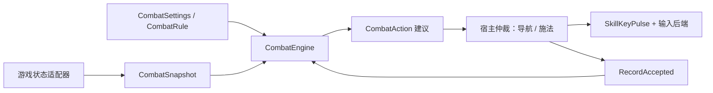

# BloodyBot.Combat

供 Bloodybot2 各导航模式共用的基础战斗模块，目标框架 `net10.0`，输出 `BloodyBot.Combat.dll`。没有 Follower、GameHelper、GameOffsets、ImGui 或 Win32 依赖，不是单独启用的 GameHelper 插件。

参考用户 [Bloodybot 的 CombatBehavior](https://github.com/mxc1868/Bloodybot/blob/cf4dc688ee6ad1b9ea16904c080df4fe8d8410f0/Combat/CombatBehavior.cs)、[TargetSelector](https://github.com/mxc1868/Bloodybot/blob/cf4dc688ee6ad1b9ea16904c080df4fe8d8410f0/Combat/TargetSelector.cs) 和 [Caster](https://github.com/mxc1868/Bloodybot/blob/cf4dc688ee6ad1b9ea16904c080df4fe8d8410f0/Actuators/Caster.cs) 的职责分离，按本项目接口重新实现基础规则和短按。未移植 ExileApi 的 PoE1 offsets、技能栏绑定解析、移动技能、鼠标瞄准或 Simulacrum 策略。

`Evaluate` 按规则顺序返回第一项满足全部条件的按键建议，不发送输入，也不消耗冷却。宿主成功发送 key-down 后才调用 `RecordAccepted`。短按未成功时可以重新评估，不缓存待发送的旧建议。`EnemyId` 只是说明哪个敌人使规则满足，当前输入执行器不会用它移动鼠标或追怪。

- 敌人条件：距离、最少数量、独立勾选普通/魔法/稀有/Unique。默认稀有和 Unique，优先报告 Unique，同稀有度选最近；死亡、友方、不可选中、已知免伤、未知稀有度和非有限坐标不计入。
- 人物条件：生命/护盾/魔力低于阈值、最低魔力、Buff 存在/缺失、指定内部技能就绪。同一条规则取 AND，多条规则可表达 OR。Buff 采用不区分大小写的部分名称匹配，技能就绪使用完整内部名。
- 数据不全：只有需要该数据的规则会被阻止；例如 Buff 集合不可用不代表 Buff 缺失，角色没有护盾不代表护盾为 0%。宿主负责把城镇、藏身处、入场保护、死亡等标记为不能战斗。
- 调度：每规则和同按键共享的最短重复间隔；全局至少间隔 300 ms，并在短按及施法停顿结束后保留至少 150 ms，供宿主恢复移动。高优先级规则冷却期间可选择后续规则。`Reset` 用于插件初始化；普通暂停和预览不能清除历史。
- `SkillKeyPulse` 通过注入的发送函数执行 30–200 ms 短按，宿主定时调用 `Expire`。停止/失焦立刻尝试松键；key-up 失败保留键归属以便重试，不允许重叠技能按键。禁止 WASD、箭头、修饰键、聊天、Esc、鼠标和功能键，宿主再过滤自己的启停键与用户已按住的技能键。
- 配置最多 32 条规则，稳定 ID 支持重排、改名后的冷却关联；重复 ID 会归一化。规则与输入均不含导航目标或策略状态。

游戏状态适配器为 `Plugins/Bloodybot2/Game/CombatSnapshotReader.cs`，运行仲裁为 `Runtime/BotRuntime.cs`，输入后端为 `Navigation/MovementInput.cs`。[Bloodybot2](../../Plugins/Bloodybot2/README.md) 通过 Chrome 配置；`INavigationMode` 当前实现为 Follow，沿用原 Follower 的寻路、双人纠偏和脱困，独立 Follower 插件已移除。纠偏/脱困优先，战斗接受后释放移动并在施法停顿结束后重新寻路。不做 Simulacrum，PoE1 策略不得直接移植。

验证：`dotnet run --project tests/Combat.Tests/Combat.Tests.csproj -c Release`。全部为合成状态和假输入测试；Windows 游戏读取、施法实际成功、施法时长、虚拟手柄映射和瞄准仍需实机确认。
