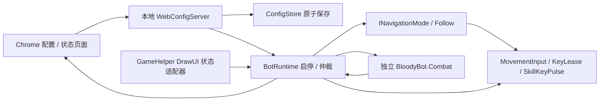

# Bloodybot2

独立 GameHelper 插件，通过本地 Web 页面配置 PoE2 基础战斗。参考用户 [Bloodybot1](https://github.com/mxc1868/Bloodybot/tree/cf4dc688ee6ad1b9ea16904c080df4fe8d8410f0) 的 Web 配置与战斗分层，在 GameHelper 的公开 API 上重新实现。**当前支持 Follow 模式，原 Follower 已整合并移除独立插件；不做 Simulacrum。**

## 使用

1. 在仓库根目录执行 `powershell -NoProfile -ExecutionPolicy Bypass -File .\rebuild-test.ps1`，编译核心、插件及 `BloodyBot.Combat.dll` 并更新 Test。提交前必须完成此步骤；脚本会备份个人配置、检查进程与文件占用。
2. 在 GameHelper 的 F12 插件列表启用 **Bloodybot2**。旧 Follower 已退役；核心会跳过遗留 DLL，新建 Bloodybot2 启用元数据时继承 Follower 的开关。
3. 插件设置里点击 **Open in Chrome**。只使用 Chrome；未找到时显示网址供手动打开，不回退到其他浏览器。正常网址为 `http://127.0.0.1:38432/`；被占用时依次尝试到 38439，以插件显示的实际地址为准。
4. 在 **General** 中明确选择 **Follow**，设置预览、战斗开关、监测角色和启停快捷键；选中后出现 **Follow** 页面，配置队长、双人角色、停止/恢复距离、寻路与脱困。技能优先级页添加技能，点击按键框后直接按键录制，配置敌人/人物条件，再 **保存并应用**。所有配置均在网页完成，原生 UI 只提供网址、Chrome 入口和状态。
5. 默认开启**预览模式**。点击“启动预览”后切回游戏，或在游戏前台按 **F6**；“实时监测”中可以查看最近一次观测的生命、护盾、魔力、四种敌人数、技能内部名、Buff 和运行记录。浏览器在前台时战斗等待游戏焦点，继续显示状态数据。
6. 确认触发条件后，在 General 关闭预览并保存，再切回游戏启动。**默认 F6 启停（General 中可录制修改），Esc 停止**。每次保存、切区、游戏关闭或禁用插件均需重新启动。画面更新中断超过 400 ms（包括 F9）会松键等待，更新恢复且游戏状态允许输入后自动继续；等待期间按 Esc、启停键或网页停止，仍需手动重新启动。

网页启动使用当前已保存配置；有草稿时启动按钮禁用。保存会停止当前运行，不会自动开始施法。修改网页草稿本身不会改变已运行配置；需要立即停止时使用“停止”。监测角色留空使用本地玩家，或填写/选择附近角色的精确名字；名称不唯一或不在读取范围内时不施法。监测 P2 不会自动路由输入，仍需用户自己的映射。

界面直接沿用 Bloodybot1 `cf4dc68` 的原始 `styles.css`，Bloodybot2 的补充布局单独放在 `bloodybot2.css`。角色/技能/Buff 候选不再随每次轮询重建；内容改变且输入框仍获得焦点时延后更新，避免打断 Chrome 选择。录制按键时 Esc、失焦或超时会取消并保留原绑定。

Follow 单人使用本地角色追队长；本地双人按 P1→队长共享 WASD，P2 落后时暂停共同移动，按 P2→P1 仅发箭头。使用者须提前完成手柄映射。近距离停止、远离恢复，失焦或面板打开时松键等待；队长暂时读不到时显示“队长暂不可见，等待重新出现”，松开移动/技能键并每隔至少 250 ms 重试，重新找到后重新寻路并自动继续。角色名称未配置、冲突或匹配不唯一仍会停止。脱困短按不保证穿过真实碰撞，也不自动开门。

停止距离只按 P1（单人时为本地角色）到队长的网格直线距离判断；进入范围即停止共同移动并取消脱困/旧路线，不再额外要求地形判定直线可走。P2 单独纠偏仍以 P2→P1 的归队距离为准。重新跟随距离至少比停止距离多 3 格，例如停止 30、恢复 33；在网页“保存并应用”后生效，游戏状态窗显示当前生效的 Stop / Resume。配置保存失败或只有网页草稿时，运行设置不会改变。

寻路返回无路线，或已有路线因当前地形/方向判定而无法继续时，立即按当前目标方向尝试直走，不再等待默认 2.5 秒无进展；首次寻路仍在计算时先等待，有路线但原地卡住仍按配置的无进展时间触发。每次推进最多 600 毫秒、随后松键观察 120 毫秒；累计移动至少 8 格才结束脱困并重新寻路，不再只移动 1 格就结束。进入停止范围、目标换方向、失焦/面板/主动停止仍可提前打断；每次输入租期最多 150 毫秒，只在新鲜有效的更新中续期。每轮最多八次，整轮失败休息 1 秒后重新寻路。无路线时的直走会尝试游戏自身的碰撞滑动，不能保证绕过真实墙体。

更新超过 150 ms 未刷新时看门狗仍释放按键；超过 400 ms 会清除旧路线并显示等待恢复。耗时超过 150 ms 的读取不能恢复导航，恢复时重新校验前台、面板、角色及区域；仅绘制状态窗不会恢复输入或刷新看门狗。技能冷却在等待和恢复之间保留。

## 战斗能力与边界

- 最多 32 条规则，支持添加、复制、删除和排序。自上而下执行首条符合条件的规则；高优先级规则冷却期间可执行后续规则。
- 默认检测 50 格内的稀有 / Unique；可独立选择普通、魔法、稀有、Unique，范围 1–150 格，并设置最少数量。怪物识别沿用 Radar 的普通怪物图标分支：AwakeEntities 中的 Monster、EntityState.None，再从 ObjectMagicProperties 取稀有度。死亡、友方和隐藏 Boss 使用核心的分类结果，不额外要求怪物血量大于 0 或 Targetable=true。Radar 的隐藏怪物分支、已知免伤、隐藏 Buff、无效实体/坐标仍不参与战斗。
- 生命 / 护盾 / 魔力低于阈值、最低魔力、存在 / 缺少 Buff、指定内部技能就绪，启用的条件取 AND。百分比使用未保留上限；数据未知时不视为满足，无护盾不当作护盾 0%。Buff 为不区分大小写的部分匹配，技能使用完整内部名。页面提供现场名称扫描，不推测 PoE1 技能栏映射。
- 按键支持字母（除 WASD）、数字、空格；不支持鼠标键、功能键、修饰键或移动键。短按 30–200 ms，默认 80 ms；重复间隔至少 300 ms，默认 2000 ms；同键规则共享间隔。按住时长 + 施法停顿后另留至少 150 ms 再发下一个技能。
- 只发送技能键，沿用当前鼠标 / 手柄瞄准。移动由 Follow 控制；不追怪、不移动鼠标、不自动战术走位，也不声称距离等同于视线可达。已发送按键仅表示 Windows 接受输入，不代表游戏施法成功。
- 失焦、聊天、面板、Ctrl/Alt/Windows/Enter/Esc、死亡、城镇/藏身处、入场保护或关键数据不可读时阻止施法。25 ms 看门狗负责短按释放；失败的 key-up 保留归属重试，包括禁用后的释放重试。手柄 UI 没有聊天指针时自动兼容，不再提供聊天许可开关；键鼠模式仍要求可读聊天状态，已识别的聊天和面板仍阻止输入。核心尚不能识别手柄聊天是否打开，使用手柄聊天前先用启停键或 Esc 停止。
- 暂停和配置保存不重置技能间隔。新插件实例从空历史开始，且始终停止；配置不会持久化运行状态。

## 配置保存与恢复

路径为运行插件目录的 `config/config.json`，当前 schemaVersion=2。首次安装读取旧 `Plugins/Follower/config/settings.txt` 的导航、预览、快捷键和战斗设置，但仍需选择模式并保存；原文件保留。已有 v1 Bloodybot2 配置优先保留自身的通用/战斗设置，只补充 Follower 导航；损坏的旧配置不覆盖有效的新配置。已有 v2 配置不再重复迁移。旧配置中的 `allowControllerWithoutChat` 会兼容读取并忽略，下次显式保存/导出不再包含该字段；加载不会改写原文件。网页支持导入 / 导出 JSON；导入先成为草稿，成功保存后才应用。Bloodybot1 配置不是兼容格式。

先校验，再写同目录临时文件并 flush，然后原子替换；保留上一版有效配置为 `config.json.bak`。保存失败返回错误，不发布新的运行配置或版本号。多个页面持有不同版本时拒绝陈旧保存（409），页面保留草稿供导出。

主配置损坏或缺失时尝试读取 `.bak` 并在网页提示；没有有效备份则显示空配置但**不自动覆盖任何文件**。用户明确保存时，损坏原文件保留为 `config.json.invalid-<时间>-<GUID>`，有效备份继续保留。GameHelper 的 `SaveSettings` 不参与写这个文件。

HTTP 仅绑定 `127.0.0.1`；验证 Host / Origin 和写入请求的随机会话令牌，不提供跨域访问。请求体上限 256 KiB、读取超时 5 秒；静态文件嵌入插件，不依赖 npm、CDN 或联网资源。

## 代码边界



- `Modules/Combat`：规则求值、优先级、冷却和短按，不引用 GameHelper、Web、Follower 或 Win32。
- `Configuration/`：版本、字段校验、备份和原子保存。
- `Runtime/`：运行状态、预览、输入仲裁、事件记录；输入和导航使用接口，可用假输入测试。`INavigationMode` 当前实现 Follow，模式在 General 中显式选择；战斗关闭或没有技能规则时仍可跟随。
- 状态窗口和路线每个绘制帧都显示；游戏数据/导航/战斗仍按 75 ms 更新，绘制不会发按键或刷新输入看门狗。
- `Navigation/`：原 Follower 的网格寻路、共享 WASD、P2 箭头纠偏、卡住后朝目标方向短按脱困，以及统一输入释放。纠偏/脱困优先，施法短按和停顿期间让出导航，随后重新寻路。
- `Game/` 与 `Bloodybot2Core`：原有公开 GameHelper API 的状态适配与生命周期。核心仅增加旧 Follower 的内部发现去重/启用元数据迁移，没有新增公共 API 或 offsets。
- `Web/`：网页和服务；HTTP 线程不读取游戏内存。配置切换后旧扫描会因版本不匹配被拒绝，发键前再次核对前台、区域、角色身份、存活及快照时效。

## 验证

```powershell
dotnet run --project tests/Bloodybot2.Tests -c Release
dotnet run --project tests/Combat.Tests -c Release
dotnet run --project tests/CombatReader.Tests -c Release
dotnet run --project tests/Follower.Tests -c Release
dotnet run --project tests/PluginLoad.Tests -c Release -- GameHelper/bin/Release/net10.0-windows/win-x64
```

已通过 118 项配置/运行/HTTP 检查、80 项 Combat、31 项怪物读取适配器、249 项 Follow 导航，以及实际加载器的 13 项检查。回环 HTTP 测试在 Windows 普通受限沙箱内无法创建 HTTP.sys 句柄，需在允许本机 HTTP 服务的环境中运行。没有测试调用真实键盘输入或连接游戏。

Chrome 页面测试使用 Node 的内置 CDP 客户端，无 npm 依赖。在一个终端运行 `dotnet run --project tests/Bloodybot2.Tests -c Release -- --serve`，将其输出的 `UI_TEST_URL` 传给 `node tests/Bloodybot2.Tests/browser-smoke.mjs <UI_TEST_URL>`。测试会创建独立的无头 Chrome 配置，连接假运行器，检查 39 项模式/导航配置/按键录制/下拉稳定性/编辑/保存/冲突/预览/导入导出/布局行为；截图保存在被忽略的 `artifacts/bloodybot2`。测试服务器按 Enter 结束或 15 分钟自动退出。

Windows 编译、实际插件加载与 Chrome 网页已验证；游戏内人物/怪物识别、技能就绪含义、手柄输入映射、实际施法效果和按键时长仍需实测。这是可编译的第一版原型，不是已通过游戏实测的发布版。
