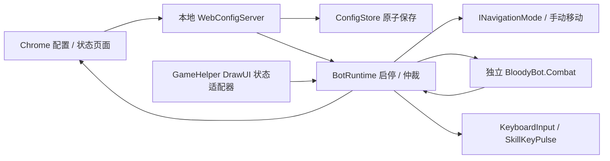

# Bloodybot2

独立 GameHelper 插件，通过本地 Web 页面配置 PoE2 基础战斗。参考用户 [Bloodybot1](https://github.com/mxc1868/Bloodybot/tree/cf4dc688ee6ad1b9ea16904c080df4fe8d8410f0) 的 Web 配置与战斗分层，在 GameHelper 的公开 API 上重新实现。**当前版本不做 Simulacrum，也未接入 Follower 导航。**

## 使用

1. 在仓库根目录执行 `dotnet build GameOverlay.sln -c Release`，插件及独立 `BloodyBot.Combat.dll` 会进入 GameHelper 的构建输出；此命令不部署到 `Test`。
2. 在 GameHelper 的 F12 插件列表启用 **Bloodybot2**。Bloodybot2 和 Follower 声明互斥，避免两套输入同时运行；已有 Follower 的启动优先级更高，安装新 DLL 不会自动抢占它。
3. 插件设置里点击 **Open in Chrome**。只使用 Chrome；未找到时显示网址供手动打开，不回退到其他浏览器。正常网址为 `http://127.0.0.1:38432/`；被占用时依次尝试到 38439，以插件显示的实际地址为准。
4. 网页“战斗编排”中添加技能，选择实际游戏按键、敌人和人物状态条件，点击 **保存并应用**。所有配置均在网页完成，原生 UI 只提供网址、Chrome 入口和状态。
5. 默认开启**预览模式**。点击“启动预览”后切回游戏，或在游戏前台按 **F6**；“实时监测”中可以查看最近一次观测的生命、护盾、魔力、四种敌人数、技能内部名、Buff 和运行记录。浏览器在前台时战斗等待游戏焦点，继续显示状态数据。
6. 确认触发条件后，在“配置文件”关闭预览并保存，再切回游戏启动。**F6 启停，Esc 停止**。每次保存、切区、游戏关闭、禁用插件或画面更新中断超过 400 ms（包括 F9）均需重新启动。

网页启动使用当前已保存配置；有草稿时启动按钮禁用。保存会停止当前运行，不会自动开始施法。修改网页草稿本身不会改变已运行配置；需要立即停止时使用“停止”。监测角色留空使用本地玩家，或填写/选择附近角色的精确名字；名称不唯一或不在读取范围内时不施法。监测 P2 不会自动路由输入，仍需用户自己的映射。

## 战斗能力与边界

- 最多 32 条规则，支持添加、复制、删除和排序。自上而下执行首条符合条件的规则；高优先级规则冷却期间可执行后续规则。
- 默认检测 50 格内的稀有 / Unique；可独立选择普通、魔法、稀有、Unique，范围 1–150 格，并设置最少数量。过滤死亡、友方、不可选中、已知免伤、隐藏及无效坐标。
- 生命 / 护盾 / 魔力低于阈值、最低魔力、存在 / 缺少 Buff、指定内部技能就绪，启用的条件取 AND。百分比使用未保留上限；数据未知时不视为满足，无护盾不当作护盾 0%。Buff 为不区分大小写的部分匹配，技能使用完整内部名。页面提供现场名称扫描，不推测 PoE1 技能栏映射。
- 按键支持字母（除 WASD）、数字、空格；不支持鼠标键、功能键、修饰键或移动键。短按 30–200 ms，默认 80 ms；重复间隔至少 300 ms，默认 2000 ms；同键规则共享间隔。按住时长 + 施法停顿后另留至少 150 ms 再发下一个技能。
- 只发送技能键，沿用当前鼠标 / 手柄瞄准。当前导航是手动移动；不追怪、不移动鼠标、不自动走位，也不声称距离等同于视线可达。已发送按键仅表示 Windows 接受输入，不代表游戏施法成功。
- 失焦、聊天、面板、Ctrl/Alt/Windows/Enter/Esc、死亡、城镇/藏身处、入场保护或关键数据不可读时阻止施法。25 ms 看门狗负责短按释放；失败的 key-up 保留归属重试，包括禁用后的释放重试。手柄 UI 的聊天状态目前不可读，默认阻止；仅在明确勾选“允许手柄模式下聊天状态不可读”后放行，打开手柄聊天前须先停止。
- 暂停和配置保存不重置技能间隔。新插件实例从空历史开始，且始终停止；配置不会持久化运行状态。

## 配置保存与恢复

路径为运行插件目录的 `config/config.json`，与 Follower 配置独立。网页支持导入 / 导出 JSON；导入先成为草稿，成功保存后才应用。Bloodybot1 配置不是兼容格式。

先校验，再写同目录临时文件并 flush，然后原子替换；保留上一版有效配置为 `config.json.bak`。保存失败返回错误，不发布新的运行配置或版本号。多个页面持有不同版本时拒绝陈旧保存（409），页面保留草稿供导出。

主配置损坏或缺失时尝试读取 `.bak` 并在网页提示；没有有效备份则显示空配置但**不自动覆盖任何文件**。用户明确保存时，损坏原文件保留为 `config.json.invalid-<时间>-<GUID>`，有效备份继续保留。GameHelper 的 `SaveSettings` 不参与写这个文件。

HTTP 仅绑定 `127.0.0.1`；验证 Host / Origin 和写入请求的随机会话令牌，不提供跨域访问。请求体上限 256 KiB、读取超时 5 秒；静态文件嵌入插件，不依赖 npm、CDN 或联网资源。

## 代码边界



- `Modules/Combat`：规则求值、优先级、冷却和短按，不引用 GameHelper、Web、Follower 或 Win32。
- `Configuration/`：版本、字段校验、备份和原子保存。
- `Runtime/`：运行状态、预览、输入仲裁、事件记录；输入和导航使用接口，可用假输入测试。`INavigationMode` 当前仅手动移动，后续可将 Follower 的导航实现接入此接口。
- `Game/` 与 `Bloodybot2Core`：原有公开 GameHelper API 的适配、生命周期和 Windows 输入；此版本没有修改核心、GameOffsets 或 Follower。`CombatSnapshotReader` 暂时在两个宿主中各有一份，以保持 Follower 交付不变。
- `Web/`：网页和服务；HTTP 线程不读取游戏内存。配置切换后旧扫描会因版本不匹配被拒绝，发键前再次核对前台、区域、角色身份、存活及快照时效。

## 验证

```powershell
dotnet run --project tests/Bloodybot2.Tests -c Release
dotnet run --project tests/Combat.Tests -c Release
dotnet run --project tests/Follower.Tests -c Release
dotnet run --project tests/PluginLoad.Tests -c Release -- GameHelper/bin/Release/net10.0-windows/win-x64
```

已通过 64 项配置/运行/HTTP 检查、80 项 Combat、222 项 Follower，以及实际加载器的 14 项检查。回环 HTTP 测试在 Windows 普通受限沙箱内无法创建 HTTP.sys 句柄，需在允许本机 HTTP 服务的环境中运行。没有测试调用真实键盘输入或连接游戏。

Chrome 页面测试使用 Node 的内置 CDP 客户端，无 npm 依赖。在一个终端运行 `dotnet run --project tests/Bloodybot2.Tests -c Release -- --serve`，将其输出的 `UI_TEST_URL` 传给 `node tests/Bloodybot2.Tests/browser-smoke.mjs <UI_TEST_URL>`。测试会创建独立的无头 Chrome 配置，连接假运行器，检查 19 项编辑/保存/冲突/预览/导入导出/布局行为；截图保存在被忽略的 `artifacts/bloodybot2`。测试服务器按 Enter 结束或 15 分钟自动退出。

Windows 编译、实际插件加载与 Chrome 网页已验证；游戏内人物/怪物识别、技能就绪含义、手柄输入映射、实际施法效果和按键时长仍需实测。这是可编译的第一版原型，不是已通过游戏实测的发布版。
